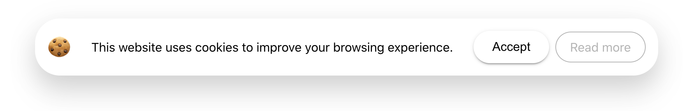
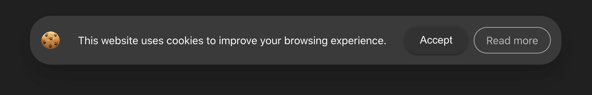

# react-cookienotice

> An awesome cookie banner for your website




[](https://www.npmjs.com/package/react-cookienotice) [](https://standardjs.com) 

[Live preview](https://xavierbriole.github.io/react-cookienotice)

## Install

```bash
yarn add react-cookienotice
```

## Usage

```jsx
import * as React from 'react'
import CookieNotice from 'react-cookienotice'

class Example extends React.Component {
  render() {
    return <CookieNotice />
  }
}
```

## Props

All props are optionals

| Key                 | Type      | Description                                                              | Default value                                                  |
| ------------------- | --------- | ------------------------------------------------------------------------ | -------------------------------------------------------------- |
| acceptButtonLabel   | `string`  | Edit the "Accept" button label                                           | Accept                                                         |
| readMoreButtonLabel | `string`  | Edit the "Read more" button label                                        | Read more                                                      |
| readMoreButtonLink  | `string`  | Edit the "Read more" button link                                         | <http://aboutcookies.org/>                                     |
| openInNewTab        | `boolean` | Open the "Read more" button link in a new tab                            | true                                                           |
| cookieTextLabel     | `string`  | Main cookie notice label                                                 | This website uses cookies to improve your browsing experience. |
| reverseButtons      | `boolean` | Reverse buttons direction                                                | false                                                          |
| borderRadius        | `number`  | Cookie notice border radius (in px)                                      | 32                                                             |
| justifyContent      | `string`  | justify-content property for wrapper (`space-around` or `space-between`) | space-between                                                  |
| maxWidth            | `number`  | Maximum cookie notice width                                              | 1000                                                           |

## License

MIT © [xavierbriole](https://github.com/xavierbriole)
