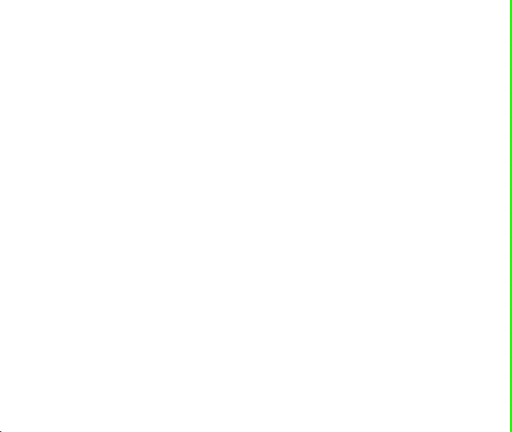

# react-cookienotice

> A lightweight & customizable cookie banner for your React App



[](https://www.npmjs.com/package/react-cookienotice)
[](https://www.npmjs.com/package/react-cookienotice)
[](https://codecov.io/gh/xavierbriole/react-cookienotice)
[](https://bundlephobia.com/package/react-cookienotice)
[](http://npm-stats.org/#/react-cookienotice)
[](https://react-cookienotice.vercel.app)

- 🍃 No dependency, full self-made package ([Bundlephobia](https://bundlephobia.com/package/react-cookienotice))
- 📱 Mobile first & responsive
- ⚙️ Customizable with several props
- ⏱️ Very fast setup (less than 1 minute)
- 🧪 Tested with unit & functional tests
- 🌙 Dark mode based on system settings
- 🌎 Translated in Deutsch, English, Español, Français, Italiano, 한국인, Occitan & 中文 ([create issue](https://github.com/xavierbriole/react-cookienotice/issues/new) or [submit pull request](https://github.com/xavierbriole/react-cookienotice/compare) for more languages)

## Install

### npm

```bash
npm i --save react-cookienotice
```

### Yarn

```bash
yarn add react-cookienotice
```

> If you're using a SSR framework like Next.js, see [Troubleshooting](#troubleshooting) section.

## Usage

```tsx
import React from 'react'
import { CookieNotice } from 'react-cookienotice'
import 'react-cookienotice/dist/style.css'

const Example = () => <CookieNotice />

export default Example
```

## Props

All props are optionals.

If you want a "Read More" link, you must set all of the following props:

- `readMoreLabel`
- `readMoreLink`
- `readMoreInNewTab`

| Key                           | Type               | Description                                                                                                               | Default value                                                                                                                                                                             |
| ----------------------------- | ------------------ | ------------------------------------------------------------------------------------------------------------------------- | ----------------------------------------------------------------------------------------------------------------------------------------------------------------------------------------- |
| acceptAllButtonLabel          | `string`           | The label for the accept all cookies button.                                                                              | Accept all (translated in browser language)                                                                                                                                               |
| onAcceptAllButtonClick        | `Function`         | A callback function to be called when the accept all cookies button is clicked.                                           | -                                                                                                                                                                                         |
| declineAllButtonLabel         | `string`           | The label for the decline all cookies button.                                                                             | Decline all (translated in browser language)                                                                                                                                              |
| onDeclineAllButtonClick       | `Function`         | A callback function to be called when the decline all cookies button is clicked.                                          | -                                                                                                                                                                                         |
| customizeButtonLabel          | `string`           | The label for the customize cookies button.                                                                               | Customize (translated in browser language)                                                                                                                                                |
| customizeTitleLabel           | `string`           | The title for the customize view.                                                                                         | Customize (translated in browser language)                                                                                                                                                |
| services                      | `ServiceObject[]`  | List of services to be customized.                                                                                        | -                                                                                                                                                                                         |
| acceptButtonLabel             | `string`           | The label for the accept button.                                                                                          | Accept (translated in browser language)                                                                                                                                                   |
| onAcceptButtonClick           | `Function`         | A callback function to be called when the accept cookies button is clicked. The first param returns the checked services. | -                                                                                                                                                                                         |
| backButtonLabel               | `string`           | The label for the back button.                                                                                            | Back (translated in browser language)                                                                                                                                                     |
| alwaysActiveLabel             | `string`           | The label for the always active services.                                                                                 | Always active (translated in browser language)                                                                                                                                            |
| customizeAcceptAllButtonLabel | `string`           | The label for the accept all button in the customize view.                                                                | Accept all (translated in browser language)                                                                                                                                               |
| customizeAcceptAllTimeout     | `number`           | The timeout for the accept all button in the customize view.                                                              | 1000                                                                                                                                                                                      |
| titleLabel                    | `string`           | The title for the cookie banner.                                                                                          | Cookie consent (translated in browser language)                                                                                                                                           |
| descriptionLabel              | `string`           | The description for the cookie banner.                                                                                    | By clicking Accept, you consent to our website's use of cookies to provide you with the most relevant experience by remembering your cookie preferences. (translated in browser language) |
| readMoreLabel                 | `string`           | The label for the read more link.                                                                                         | -                                                                                                                                                                                         |
| readMoreLink                  | `string`           | The link for the read more label.                                                                                         | -                                                                                                                                                                                         |
| readMoreInNewTab              | `boolean`          | Whether the read more link should open in a new tab.                                                                      | -                                                                                                                                                                                         |
| placement                     | `PlacementOptions` | The placement of the cookie banner.                                                                                       | { vertical: 'bottom', horizontal: 'left' }                                                                                                                                                |
| cookieOptions                 | `CookieOptions`    | Cookie options.                                                                                                           | { name: 'hide-notice', value: 'true', expires: 30, secure: false, httpOnly: false, sameSite: 'lax' }                                                                                      |

## Troubleshooting

### I'm using a SSR framework like Next.js and I have this error on build: `document is not defined`

For SSR you need to import dynamically the module with [`next/dynamic`](https://nextjs.org/docs/advanced-features/dynamic-import#with-no-ssr) using `{ ssr: false }`. This prevents the component from being included on the server, and dynamically loads it on the client-side only.

Create a new file which include the CookieNotice component :

```tsx
import { CookieNotice } from 'react-cookienotice'
import 'react-cookienotice/dist/style.css'

export default function CookieBanner() {
  return <CookieNotice />
}
```

then you can import it wherever the component is used :

```tsx
import dynamic from 'next/dynamic'

const CookieBanner = dynamic(() => import('./cookie-banner'), { ssr: false })

export default function Home() {
  return <CookieBanner />
}
```

## License

MIT © [xavierbriole](https://github.com/xavierbriole)

## Credits

Built with [Vite](https://vitejs.dev) ⚡

<a href="https://vitejs.dev" target="_blank" rel="noopener noreferrer">
    
</a>
